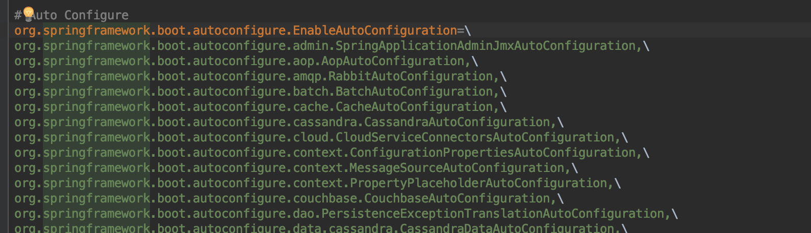

# Spring boot
- 스프링 부트란?
	1. 제품 수준의 어플리케이션을 쉽게 만들수 있다.
	2. 서드파티, 스프링 설정등을 최선의 설정들로 자동 설정 해주어 빠르게 적용할 수 있게 해준다. ex) 톰캣 설정

- 목적
	1. 스프링 개발 시 빠르고 폭넓은 사용성 제공
	2. 일일히 설정 하지 않아도 최선의 설정을 제공 하지만 원하는 설정을 설정할 수 있음
	3. 비즈니스 로직을 구현하는데 필요한 기능 뿐만 아니라 non-functional한 피쳐들(embedded servers, security, metrics, health checks, externalized configuratuin)의 기능 제공
	4. code generation & xml 설정을 더이상 하지 않는다.

# getting-Started

1. 프로젝트 생성
2. pom.xml 파일에 코드 추가

~~~
    <!-- Inherit defaults from Spring Boot 의존성 관리 (부모 프로젝트 설정)-->
    <parent>
        <groupId>org.springframework.boot</groupId>
        <artifactId>spring-boot-starter-parent</artifactId>
        <version>2.1.2.RELEASE</version>
    </parent>

        <!-- Add typical dependencies for a web application -->
    <dependencies>
        <dependency>
            <groupId>org.springframework.boot</groupId>
            <artifactId>spring-boot-starter-web</artifactId>
        </dependency>
    </dependencies>

        <!-- Package as an executable jar -->
    <build>
        <plugins>
            <plugin>
                <groupId>org.springframework.boot</groupId>
                <artifactId>spring-boot-maven-plugin</artifactId>
            </plugin>
        </plugins>
    </build>

~~~

# 의존성 관리
* pom.xml에 정의한 parent를 따라가면 dependency management가 정의되어 있음.
*  dependency management 에 정의되어있는 라이브러리를 사용할 경우 버전을 명시하지 않아도 디폴트 버전으로 관리됨 (버전 명시할 경우 디폴트여도 해당 버전을 가져옴)
*  관리되지 않는 라이브러리를 사용할때는 꼭 버전을 명시해야한다!!
*  스프링부트가 관리하는 의존성 버전을 바꾸고 싶을 때
ex) properties 추가 후 버전 명시 (spring boot 버전 변경)  

~~~
    <properties>
        <spring.version>5.1.3.RELEASE</spring.version>
    </properties>

~~~

# EnableAutoConfigure

* @SpringBootApplication
 = @SpringBootConfiguration +
   @ComponentScan (빈 첫번째 등록) +
	 @EnableAutoConfiguration (자동설정 빈 등록)

* @SpringBootApplication 이 하는 일
 1.  @ComponentScan (해당 클래스부터 하위클래스까지 검색)
 = Component라는 어노테이션을 가진 클래스들을 찾아서 빈으로 등록
 2. @EnableAutoConfiguration
  - spring-boot-autoconfigure 에 있는 설정들(/META-INF/spring.factories)을 가지고 와서 bean으로 등록!
  - 조건에 따라 bean 등록 (@ConditionalOn~ )
	ex) @ConditionalOnMissingBean = 빈이 존재하면 등록 X
 3. @ConfigurationProperties("prefix")
  - @EnableConfigurationProperties(~Properties.class)

